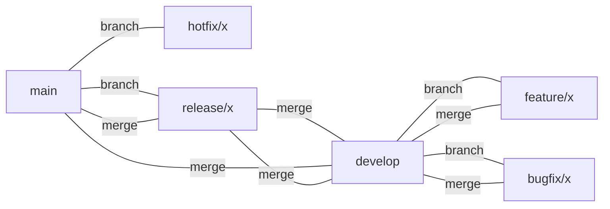
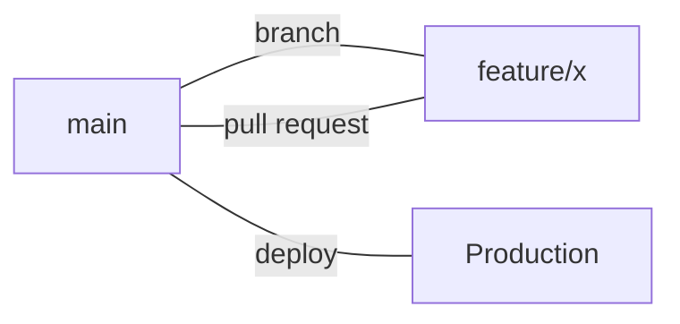

# Source Control Overview: Git, Git Flow & GitHub Flow

Effective source control is essential for collaboration, code quality, and project stability. NCS internal and client projects use **Git** as the version control system, and adopt either the **Git Flow** or **GitHub Flow** branching models depending on project needs.

## Why Git?
Git is a distributed version control system that enables teams to track changes, collaborate efficiently, and maintain a complete history of the codebase. It is the industry standard for modern software development.

## Branching Strategies

### Git Flow
Git Flow is a robust branching strategy ideal for projects with scheduled releases and multiple environments (e.g., development, staging, production). It defines clear roles for different branches:

- **main**: Always production-ready; contains the latest release.
- **develop**: Integration branch for features; reflects the latest development changes.
- **feature/**: Used for new features; branched from `develop`.
- **bugfix/**: Used for bug fixes; branched from `develop`.
- **release/**: Prepares for a new production release; branched from `develop`.
- **hotfix/**: Urgent fixes for production; branched from `main`.

All changes are made in branches and merged via pull requests. Direct commits to `main` or `develop` are not allowed.

**Diagram:**

---

### GitHub Flow
GitHub Flow is a simpler, more lightweight workflow, best suited for projects with continuous delivery and frequent deployments. It uses only a single long-lived branch (`main` or `master`) and short-lived feature branches:

- **main**: Always deployable; all changes are merged here.
- **feature/**: Created from `main` for new work (features, fixes, etc.).

Workflow:
1. Create a branch from `main` for your work.
2. Open a pull request early for feedback and CI.
3. Merge into `main` after review and successful tests.
4. Deploy from `main`.

**Diagram:**

---

## Comparison: Git Flow vs GitHub Flow

| Aspect            | Git Flow                                      | GitHub Flow                          |
|-------------------|-----------------------------------------------|--------------------------------------|
| Complexity        | Higher (multiple long-lived branches)          | Simpler (single long-lived branch)   |
| Release Model     | Scheduled, versioned releases                  | Continuous delivery                  |
| Environments      | Supports multiple (dev, staging, prod)         | Typically single (prod)              |
| Branch Types      | main, develop, feature, release, hotfix, bugfix| main, feature                        |
| Use Case          | Enterprise, regulated, or complex projects     | Startups, open source, fast delivery |
| Merge Strategy    | PRs to develop/main, release/hotfix branches   | PRs to main only                     |

---

## Key Practices
- Use [branching.md](./branching.md) for branch types, naming, and workflow
- Follow [versioning.md](./versioning.md) for semantic versioning and tagging
- Use [merge-strategies.md](./merge-strategies.md) for pull request and merge best practices

---
For details on each topic, see the linked documents above. Adhering to these practices ensures a clean, maintainable, and collaborative codebase.
