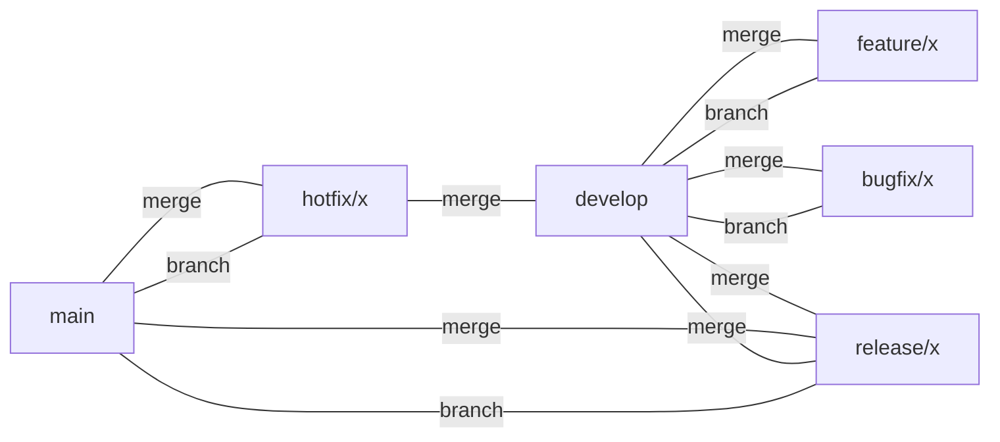
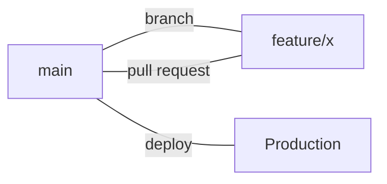

# Git Branching Strategies

NCS projects use either **Git Flow** or **GitHub Flow** depending on project requirements. This guide details both approaches, including branch types, workflows, and naming conventions.

---

## Git Flow
Git Flow is suited for projects with scheduled releases and multiple environments. It uses several long-lived and short-lived branches:

### Branch Types
- **main**: Always deployable, production-ready code.
- **develop**: Integration branch for features; stable but not always production-ready.
- **feature/xxx**: For new features (e.g., `feature/login-page`).
- **bugfix/xxx**: For bug fixes (e.g., `bugfix/login-error`).
- **release/xxx**: For preparing a release (e.g., `release/1.2.0`).
- **hotfix/xxx**: For urgent fixes to production (e.g., `hotfix/critical-crash`).

### Workflow
1. Create a `feature/` or `bugfix/` branch from `develop`.
2. Merge feature/bugfix into `develop` via pull request.
3. When ready to release, create a `release/` branch from `develop`.
4. Finalize and test in `release/`, then merge into both `main` and `develop`.
5. Tag the release on `main`.
6. For urgent production fixes, create a `hotfix/` branch from `main`, then merge into both `main` and `develop`.

### Diagram

### Naming Conventions
- Use lowercase, hyphen-separated names for clarity (e.g., `feature/user-login`).
- Prefix with type: `feature/`, `bugfix/`, `release/`, `hotfix/`.

---

## GitHub Flow
GitHub Flow is a lightweight workflow ideal for continuous delivery and frequent deployments. It uses a single long-lived branch and short-lived feature branches.

### Branch Types
- **main**: Always deployable, production-ready code.
- **feature/xxx**: For new work (features, fixes, etc.), branched from `main` (e.g., `feature/login-page`).

### Workflow
1. Create a `feature/` branch from `main` for your work.
2. Commit and push changes to the feature branch.
3. Open a pull request early for feedback and CI.
4. After review and successful tests, merge into `main`.
5. Deploy from `main`.

### Diagram

### Naming Conventions
- Use lowercase, hyphen-separated names for clarity (e.g., `feature/user-login`).
- Prefix with `feature/` for all new work.

---

## Choosing a Strategy
- Use **Git Flow** for complex projects with multiple environments and scheduled releases.
- Use **GitHub Flow** for projects with continuous delivery and frequent deployments.

For more on workflow, see [merge-strategies.md](./merge-strategies.md) and [versioning.md](./versioning.md).
