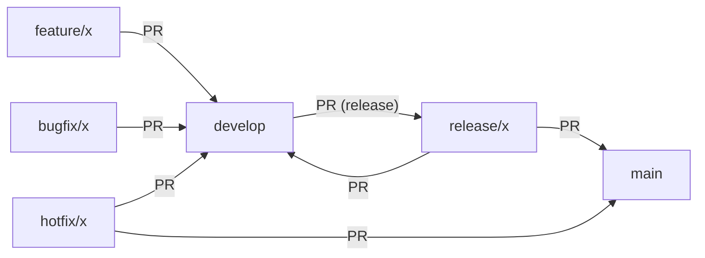

# Merge Strategies: Git Flow & GitHub Flow

This guide covers recommended merge strategies for both **Git Flow** and **GitHub Flow** workflows.

---

## Git Flow Merge Strategies

- **Pull Requests (PRs):** All changes are merged via PRs for review and traceability.
- **Feature/Bugfix Branches:**
	- Merge into `develop` using **Squash and Merge** for a clean, linear history.
	- Use **Merge Commit** if you need to preserve the full branch history (less common).
- **Release/Hotfix Branches:**
	- Merge into both `main` and `develop` using **Merge Commit** to preserve context.
- **No direct commits to `main` or `develop`.**
- Always resolve conflicts before merging.

**Diagram:**


---

## GitHub Flow Merge Strategies

- **Pull Requests (PRs):** All changes are merged via PRs for review and CI.
- **Feature Branches:**
	- Merge into `main` using **Squash and Merge** (recommended for a simple, linear history).
	- Use **Rebase and Merge** if you want to keep a flat history and have rebased locally.
- **No direct commits to `main`.**
- Always resolve conflicts before merging.

**Diagram:**


---

## Choosing a Merge Strategy
- **Squash and Merge:** Default for most PRs; creates a single commit for the branch.
- **Merge Commit:** Use for release/hotfix branches in Git Flow, or when you need to preserve all commits.
- **Rebase and Merge:** Use with caution; only after rebasing locally and ensuring a clean history.


---

## Using Cherry-Pick

While not required for standard Git Flow or GitHub Flow, `git cherry-pick` is useful for selectively applying specific commits from one branch to another. Common scenarios include:

- **Backporting fixes:** Apply a bug fix from `develop` or `main` to a `hotfix/` or `release/` branch without merging unrelated changes.
- **Selective updates:** Move a single feature or fix to another branch when a full merge is not appropriate.

**Best Practices:**
- Use cherry-pick sparingly; prefer merges and pull requests for regular workflows.
- Always test after cherry-picking to ensure no conflicts or regressions.
- Document cherry-picked commits in pull requests or changelogs for traceability.

**Example:**

```sh
# Cherry-pick a commit from develop to hotfix branch
git checkout hotfix/1.2.1
git cherry-pick <commit-hash>
```

For more, see [Git documentation on cherry-pick](https://git-scm.com/docs/git-cherry-pick).
