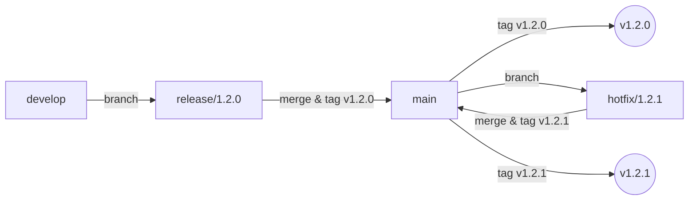
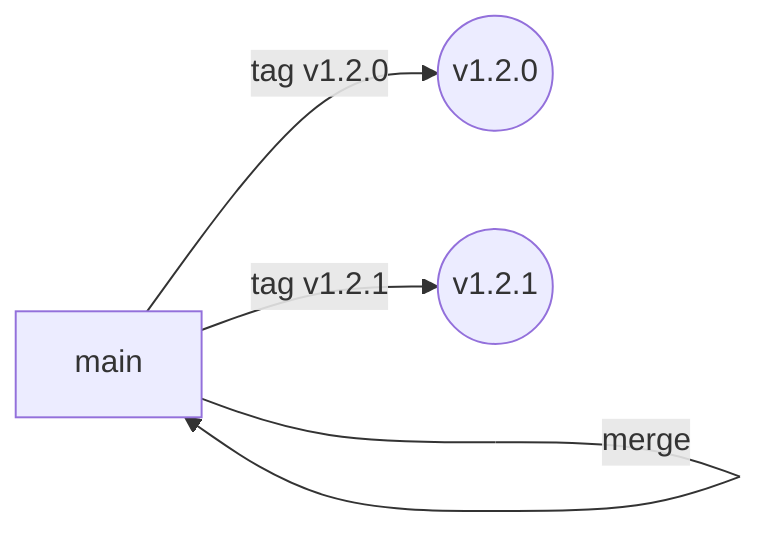

# Versioning Strategy: Git Flow & GitHub Flow

This guide explains how versioning is managed in both **Git Flow** and **GitHub Flow** workflows.

---

## Semantic Versioning (SemVer)
All projects use [Semantic Versioning](https://semver.org/):

`MAJOR.MINOR.PATCH` (e.g., `1.2.3`)

- **MAJOR**: Incompatible API changes
- **MINOR**: Backwards-compatible new features
- **PATCH**: Backwards-compatible bug fixes

---

## Git Flow Versioning
- Releases are prepared in `release/` branches.
- When ready, merge `release/` into `main` and tag the release (e.g., `v1.2.3`).
- Hotfixes are tagged after merging `hotfix/` into `main`.
- Maintain a `CHANGELOG.md` to document changes for each release.

**Diagram:**

---

## GitHub Flow Versioning
- All changes are merged into `main`.
- Tag releases on `main` when deploying to production (e.g., `v1.2.3`).
- Use a `CHANGELOG.md` to track notable changes.

**Diagram:**

---

## Best Practices
- Tag every production release with a semantic version.
- Keep `CHANGELOG.md` up to date.
- Use pre-release tags (e.g., `v1.2.0-beta`) for testing.

For more, see [branching.md](./branching.md) and [merge-strategies.md](./merge-strategies.md).
